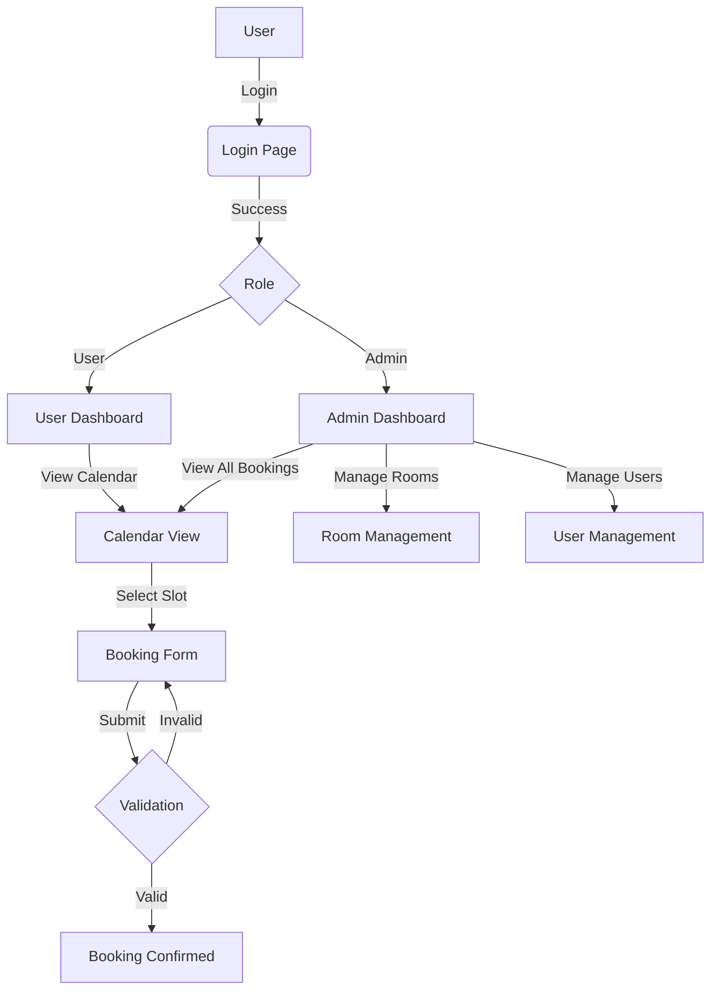

# Meeting Room Booking System

## 1. Objectives

The primary objective of this project is to provide an efficient and user-friendly web application for managing meeting room bookings within an organization. It aims to:

- Simplify the process of reserving meeting rooms.
- Prevent booking conflicts.
- Provide administrators with tools to manage rooms and users effectively.
- Visualize room availability through an interactive calendar.

## 2. Flow Diagram



## 3. Features

### User Features

- **Authentication**: Secure login system.
- **Dashboard**: View personal bookings and room availability.
- **Calendar View**: Interactive calendar to see room schedules.
- **Booking Management**:
  - Book a meeting room.
  - Specify meeting topic, time, and attendees.
  - Set private bookings with pin codes.
  - Create recurring bookings.
  - Cancel own bookings.
- **Profile Management**: Change password.

### Admin Features

- **Room Management**: Add, edit, and delete meeting rooms. Set room status (Available, Maintenance, Occupied).
- **User Management**: Manage user accounts and roles.
- **Reports**: View usage statistics and logs.

## 4. Usage Instructions

### Prerequisites

- Node.js (v18 or higher recommended)
- SQL Server
- npm or yarn

### Installation

1. **Clone the repository**

   ```bash
   git clone <repository_url>
   cd meetng_room_project
   ```
2. **Backend Setup**

   ```bash
   cd backend
   npm install
   ```
   - Create a `.env` file in the `backend` directory and configure your `DATABASE_URL` and other environment variables.
   - Run database migrations/seed:
     ```bash
     npx prisma db push
     npx prisma db seed
     ```
   - Start the backend server:
     ```bash
     npm run dev
     ```
3. **Frontend Setup**

   ```bash
   cd ../frontend
   npm install
   ```
   - Start the frontend development server:
     ```bash
     npm run dev
     ```
4. **Access the Application**

   - Open your browser and navigate to `http://localhost:3000` (or the port specified in your frontend config).
